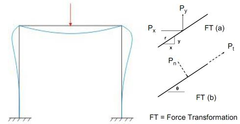

Portal frames are frequently used over the entrance of a bridge and as a main stiffness element in building design in order to transfer horizontal forces applied at the top of the frame to the foundation. On bridges, these frames resist the forces caused by wind, earthquake, and unbalanced traffic loading on the bridge deck. Portals can be pin supported, fixed supported, or supported by partial fixity. The approximate analysis of each case will now be discussed for a simple three-member portal.

[Read more](http://bsa-iiith.vlabs.ac.in/exp5/Exp-5%20Portal%20frames.pdf)